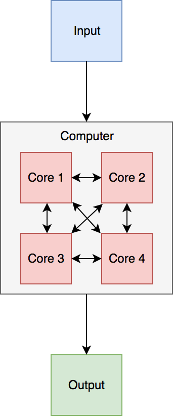
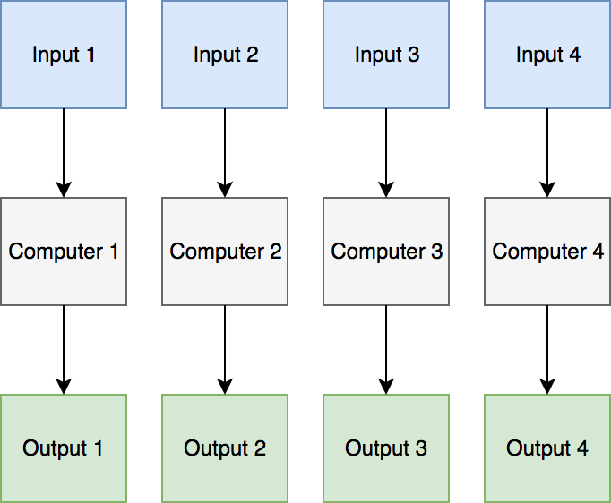

```{r setup, include=FALSE}
knitr::opts_chunk$set(echo = TRUE)
```

```{r, include=FALSE}

#Challenge number auto update
challengeNumber=0
challenge = function(){
  challengeNumber <<- challengeNumber + 1
  return(challengeNumber)
}

```


## What is ResPlat?

- Cloud & High Performance Computing
- Data Storage & Management
- Training & Community
- Part of University Services: Here for all academic departments

<p align="center"> 

</p>
<!--  -->

<div class="notes">

So you probably already have basics down for intro course if you are here.

I touch on HPC and cloud here, but the details are covered in seperate courses (or you can work it out on your own from docs).

</div>

## Related Courses
- Intro to Python
- HPC
- Cloud Computing
- Intro to Pandas

## Improving the speed of your R code
>"R is not a fast language. This is not an accident. R was purposely designed to make data analysis and statistics easier for you to do. It was not designed to make life easier for your computer." 

-- *Hadley Wickham (Advanced R)*


## Today
- Part 1: Profiling (why is my code slow)
- Part 2: Optimisation (fix my slow code)
- Part 3: Parallellisation (run multiple bits of code at once)
- Part 4: Cloud & High Performance Computing (f%^$ it, gimme a bigger computer please)

**Goal**: Less waiting, more research.

We will be using this google Doc: http://go.unimelb.edu.au/t9c6

<div class="notes">
I'm going to unleash upon you a feast of tools, technologies, jargon and acronyms.

But just because it's on the table doesn't mean you have to eat it!

And you'll probably forget most of the details when you wake up tomorrow.

That's okay!

These slides are here for you later, Google is your friend, and we're here to help. If nothing else, remember that you don't have to tolerate slow code if you don't want to, you do have options.
</div>

## Resources

- Link to slides/code: https://github.com/resbaz/high-performance-r-course
- Many of our slides are based on the [Advanced R Book](http://adv-r.had.co.nz/Performance.html) 
- We are here to help:
  - David Pery: perry.d@unimelb.edu.au
  - Pablo Franco: pablo.franco.dn@gmail.com
  
*Throughout these slides you can press 'p' to see the slide notes.*
  
## Part 1: Profiling

- Where is our code slow?: 
  - Remember we want to work smarter not harder: It's only worth optimising the code that could make a *significant* difference.

<p align="center"> 

</p>

## Part 1: Profiling

- Where is our code slow?: 
  - Let's find the bottleneck(s)!
    - [Microbenchmark](https://cran.r-project.org/web/packages/microbenchmark/)
    - [profvis](https://rstudio.github.io/profvis/index.html) (The new *lineprof*)
  
<div class="notes">
Before we do anything else, we should figure out where our code is slow. It's no use throwing a bunch of fancy tricks at the problem if you don't know where it lies. Profiling will help you figure out what's taking the most time in your code, and focus your efforts there.
</div>


## Time your code with Microbenchmark

```{r echo=TRUE}
#install.packages("microbenchmark")
library(microbenchmark)

x <- runif(100)
microbenchmark(
  sqrt(x),
  x ^ 0.5
)
```

Instead of using `microbenchmark()`, you could use the built-in function `system.time()`. But `system.time()` is much less precise.

<div class="notes">
By default, microbenchmark() runs each expression 100 times (controlled by the times parameter). In the process, it also randomises the order of the expressions. It summarises the results with a minimum (min), lower quartile (lq), median, upper quartile (uq), and maximum (max). Focus on the median, and use the upper and lower quartiles (lq and uq) to get a feel for the variability. In this example, you can see that using the special purpose sqrt() function is faster than the general exponentiation operator.
</div>

## Profvis

- Uses data collected by Rprof, which is part of the base R distribution. 
- At each time interval (profvis uses a default interval of 10ms), the profiler stops the R interpreter, looks at the current function call stack, and records it to a file. 
    - Since it works by sampling). Each time you profile your code, the result will be slightly different.
- The code panel also shows memory allocation and deallocation.
    - Interpreting this information can be a little tricky (See Notes) 

<div class="notes">
Interpreting memory information can be tricky because it does not necessarily reflect memory allocated and deallocated at that line of code. The sampling profiler records information about memory allocations that happen between the previous sample and the current one. This means that the allocation/deallocation values on that line may have actually occurred in a previous line of code.
</div>

## [Profvis Example](https://rstudio.github.io/profvis/)

```{r eval=FALSE, include=TRUE}
#install.packages("profvis")
library(profvis)

profvis({
  data(diamonds, package = "ggplot2")

  plot(price ~ carat, data = diamonds)
  m = lm(price ~ carat, data = diamonds)
  abline(m, col = "red")
})

```

*You can also access profvis by going to Profile > Profile Selected lines*

<div class="notes">
Opening and saving profiles: Profiles can be saved for sharing or viewing in the future. Profile files have extension  .Rprofvis. If you wish to share a profile for viewing in a web browser, you can simply rename the file to have an  .html extension.
</div>


## Part 2: Optimise your code

**Before Optimising Orginise your code**

When tackling a bottleneck, you're likely to come up with multiple approaches. Write a function for each approach, encapsulating all relevant behaviour. This makes it easier to check that each approach returns the correct result and to time how long it takes to run.

## Basic Optimisation Tips:
- `read.csv()`: specify known column types with colClasses.

- `factor()`: specify known levels with levels.

 - `cut()`: don't generate labels with `labels = FALSE` if you don't need them, or, even better, use `findInterval()` as mentioned in the 'see also' section of the documentation.

 - `unlist(x, use.names = FALSE)` is much faster than `unlist(x)`.

- `interaction()`: if you only need combinations that exist in the data, use `drop = TRUE`.

- If you're converting continuous values to categorical make sure you know how to use `cut()` and `findInterval()`.


## Challenge `r challenge()`

**Read new_diamonds dataset and see compute time differences when specifying columns while using read.csv(). Do this analysis using profvis.**


## Optimisation with Vectorisation

Using vectorisation for performance means finding the existing R function that is implemented in C and most closely applies to your problem. *The loops in a vectorised function are written in C instead of R. Loops in C are much faster.*


## Optimisation with Vectorisation

`rowSums()`, `colSums()`, `rowMeans()`, and `colMeans()`. These vectorised matrix functions will always be faster than using `apply()`. You can sometimes use these functions to build other vectorised functions.

**Challenge `r challenge()`:**

Verify the differences in compute time when calculating means of the numeric values of `new_diamonds`.

- Subset the relevant columns `new_diamonds_num = new_diamonds = new_diamonds[,c(1,3)]`
- Use microbenchmark on `colMeans()` and  `apply`

## Avoid Copies:
A source of slow R code is growing an object with a loop. Whenever you use `c()`, `append()`, `cbind()`, `rbind()`, or `paste()` to create a bigger object, R must first allocate space for the new object and then copy the old object to its new home.

**Challenge `r challenge()`: Verify the compute time differences between:**

2. Preallocating the memory create a new vector with `newvector=1:1000000`
1. Create the same vector by generating a loop that grows the vector size with `newvector=c(newvector,x)`


## Byte Code Compile your function
```{r}
lapply2 <- function(x, f, ...) {
  out <- vector("list", length(x))
  for (i in seq_along(x)) {
    out[[i]] <- f(x[[i]], ...)
  }
  out
}

lapply2_c <- compiler::cmpfun(lapply2)
```
*All base R functions are byte code compiled by default.*

## Challenge `r challenge()`

**What does the lapply2 function do? Check compute time difference between `lapply` and `lapply2`.**

- To do this you could apply the function `mean` to `x=list(1:200,1:10,100:340,10:90)`

## Rewrite functions in C++

```{r}
library(Rcpp)

cppFunction('int add(int x, int y) {
  int sum = x + y;
  return sum;
}')
# add works like a regular R function
add
```
To compile the C++ code, use `sourceCpp("path/to/file.cpp")`.

<div class="notes">
Rcpp provides a lot of sugar functions. These funtions are C++ functions that work very similar to their R equivalents. Rcpp sugar makes it possible to write efficient C++ code that looks almost identical to its R equivalent. If there's a sugar version of the function you're interested in, you should use it!
</div>

## Challenge `r challenge()`. 

Modify the `add` function to return multiplication for 3 integers and check compute time differences with standard R operator. Do you expect a difference?

Can you extend the function to multiplication of 3 number in general?


## Part 3: Parallelisation

Run many things in *parallel*...

Some basic concepts (See a nice description [here](https://nceas.github.io/oss-lessons/parallel-computing-in-r/parallel-computing-in-r.html) ):

- Core and CPU's (Processors) 

- Node (Computer)

Find the mateiral we will be following [here](http://dept.stat.lsa.umich.edu/~jerrick/courses/stat701/notes/parallel.html) by Josh Errickson.


## Part 3: Parallelisation

<p align="center"> 

</p>

## Part 3: Parallelisation

<p align="center"> 

</p>

## Two types of parallelisation:

- **Socket**: Launches a new version of R on each core. 

- **Forking**: Copies the entire current version of R and moves it to a new core.

There are various pro???s and con???s to the two approaches...

## Socket:

>- Pro: Works on any system (including Windows).

>- Pro: Each process on each node is unique so it can???t cross-contaminate.

>- Con: Each process is unique so it will be slower

>- Con: Things such as package loading need to be done in each process separately. Variables defined on your main version of R don???t exist on each core unless explicitly placed there.

>- Con: More complicated to implement.

## Forking:

>- Con: Only works on POSIX systems (Mac, Linux, Unix, BSD) and not Windows.

>- Con: Because processes are duplicates, it can cause issues specifically with random number generation (which should usually be handled by parallel in the background) or when running in a GUI (such as RStudio). This doesn???t come up often, but if you get odd behavior, this may be the case.

>- Pro: Faster than sockets.

>- Pro: Because it copies the existing version of R, your entire workspace exists in each process.

>- Pro: Trivially easy to implement.

## Setting up parallelisation

We will need the `parallel` package for parallelisation. This is a base pacakge and thus needs no installing, but does require calling it.
```{r}
library(parallel) 
```

How many cores do I have access to?
```{r}
detectCores()
```


## Forking Example 

We will run this function 1000 times and see if parallelisation speeds things up.

```{r}
library(lme4)
f <- function(i) {
  lmer(Petal.Width ~ . - Species + (1 | Species), data = iris)
}
```

## Forking Example

- Serial
```{r}
system.time(save1 <- lapply(1:1000, f))
```

- Parallel
```{r}
system.time(save2 <- mclapply(1:1000, f))
```

Microbenchmark provides some weird results if used here. Any ideas why?

<div class="notes">
`mclapply` takes an argument, `mc.cores`. By default, `mclapply` will use all cores available to it. 
</div>


## Socket Example 

The general process to follow is

1. Start a cluster with n nodes.

2. Execute any pre-processing code necessary in each node (e.g. loading a package)

3. Use par*apply as a replacement for *apply.

4. Destroy the cluster.


## Start a cluster

Start a cluster
```{r}
numCores =detectCores() #Number of cores to be used for the socket
cl = makeCluster(numCores)
```

Run something on each cluster
```{r}
clusterEvalQ(cl, 2 + 2)
```

## Cluster pre-processing

Load packages to the cluster
```{r}
clusterEvalQ(cl, library(lme4)) 
```

## Cluster pre-processing

Exports variables to the cluster
```{r}
crazy_word = "Supercalifragilisticexpialidocious"
clusterExport(cl, "crazy_word")
clusterEvalQ(cl, paste0(crazy_word," is CRAZY!!!"))
```


## Run something and Destroy the Cluster

```{r}
titanic = read.csv("https://goo.gl/4Gqsnz")
parSapply(cl, titanic, mean, na.rm = TRUE)
```

```{r}
stopCluster(cl)
```


<div class="notes">
Destroying the cluster is not necessary, but it is best practice. If not stopped, the processes will continue to run in the background. 
</div>

## Parallelisation Challenge

**Challenge `r challenge()` (Advanced)**

Sample 20 passengers from the titanic and calculate the mean_age. Do this 10000 times (in parallel).

Use the titanic DataSet: `titanic <- read.csv("https://goo.gl/4Gqsnz")`

- Does the code run faster if run in parallel?

*Tip: Remove NA's using `na.omit(titanic)`*


## Summary: How to run R code faster?

- Profile and attack bottlenecks.
- Optimise by:
    - Following basic tips
    - Vectorising 
    - Avoiding Copies
    - Byte Code Functions
    - Rewrite functions in C++
  

## Summary: How to run R code faster?

If everything else is still not enough then....
  
- Use more computing power
    - Parallelise.
    - If still not enough: Use High Performance Computers (e.g Spartan)! 

## Run your code on HPC (Spartan)

- [Spartan Documentation](https://dashboard.hpc.unimelb.edu.au/)
- [Intro to Spartan](https://doi90.github.io/lodestar/introduction-to-spartan.html) by David Wilkinson
- [Installing R packages on Spartan](https://doi90.github.io/lodestar/installing-r-packages-on-spartan.html) by David Wilkinson

## Other....

- Memory allocation
    - Memory bottlenecks with [pryr](https://github.com/hadley/pryr)

library(pryr)

x <- 1:1e6
object_size(x)

y <- list(x, x, x)
object_size(y)

mem_used()

mem_change(rm(y))

There are two downsides to profiling:

read_delim() only takes around half a second, but profiling can, at best, capture memory usage every 1 ms. This means we???ll only get about 500 samples.

Since GC is lazy, we can never tell exactly when memory is no longer needed.

You can work around both problems by using torture = TRUE, which forces R to run GC after every allocation (see gctorture() for more details). This helps with both problems because memory is freed as soon as possible, and R runs 10???100x slower. This effectively makes the resolution of the timer greater, so that you can see smaller allocations and exactly when memory is no longer needed


